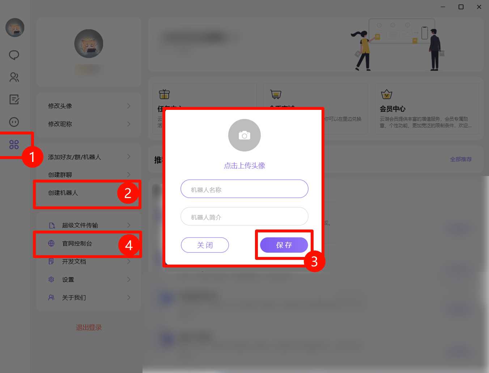
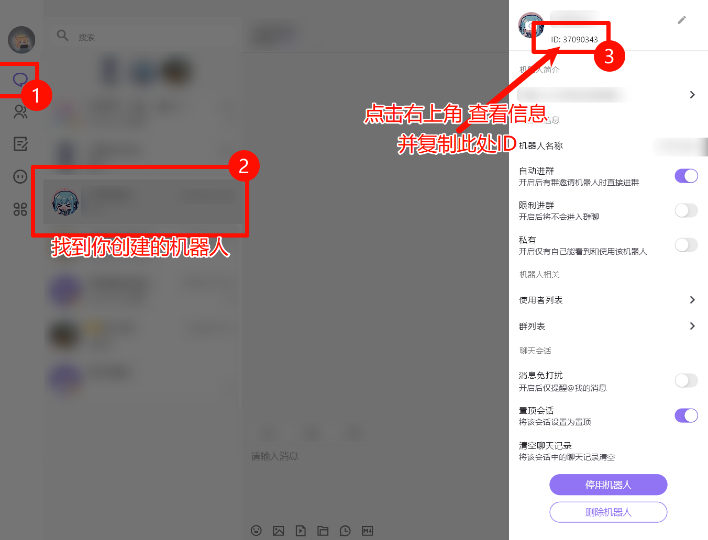
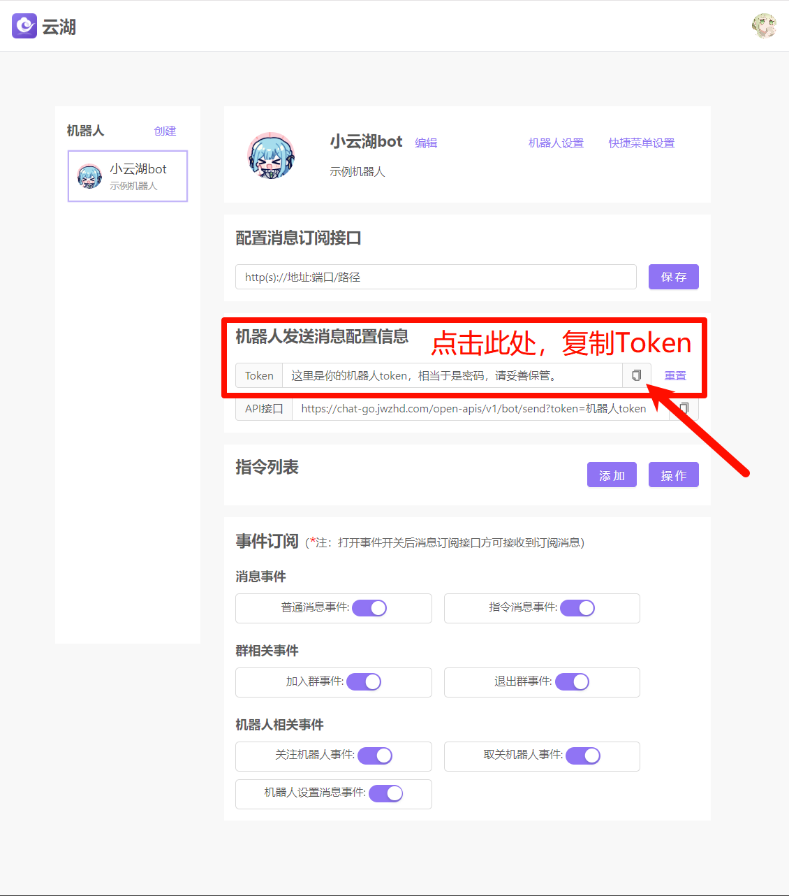
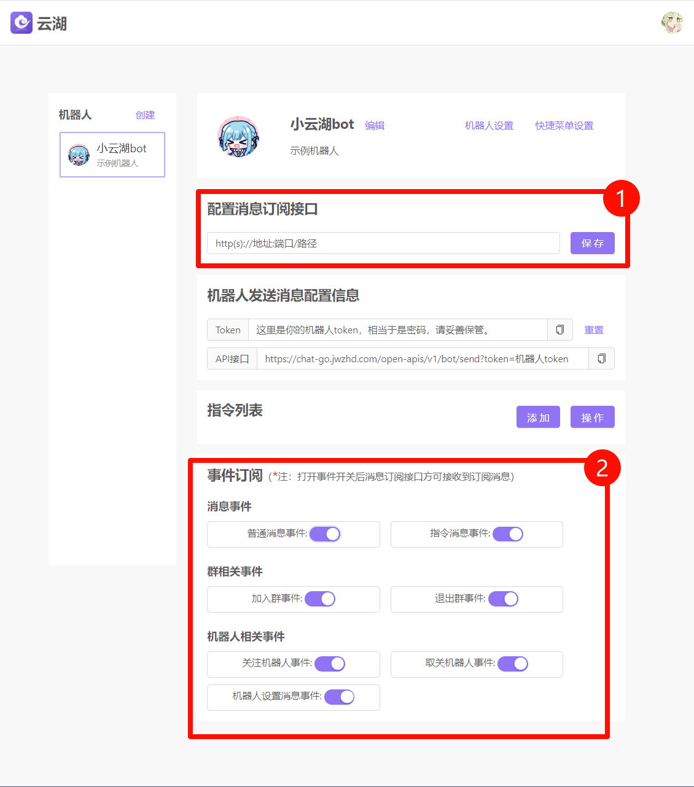

# 首次接入指南

本指南将引导您完成 `adapter-yunhupro` 在 Koishi 中的首次接入和配置。

## 1. 前置要求：公网访问

云湖平台通过 Webhook 将事件（如消息、成员变动等）推送给您的机器人。

因此，在开始之前，您必须确保 Koishi 实例能够被公网访问。

:::tip
这意味着您需要具备**以下条件之一**：

*   拥有一个公网 IPv4 或 IPv6 地址。
*   使用内网穿透服务（如 frp, Ngrok, Cloudflare Tunnel 等）将您的本地 Koishi 服务暴露到公网。
:::

具体的公网部署方法多样，本指南不详细展开。

请根据您的实际网络环境选择合适的方案。

## 2. 在云湖平台创建机器人

> 下面教程以 云湖Windows版客户端 演示

访问 [云湖官网](https://www.yhchat.com/) 并进入后台控制台，创建一个新的机器人。

## 3. 获取机器人凭证

下面需要复制机器人账号的两个信息：ID、Token。

1. 打开云湖客户端，在与机器人的聊天对话页面，复制机器人的账号ID：

*   **机器人 ID (Bot ID)**：这是您机器人的唯一标识。
    

2. 打开[官网控制台](https://www.yhchat.com/control)，复制机器人的Token：

*   **机器人 Token**：这是与云湖 API 通信的密钥。
    

## 4. 配置 Koishi 适配器

在 Koishi 的插件市场中找到并安装 `adapter-yunhupro` 适配器，然后进入配置页面。

将上一步获取的 **机器人 ID** 和 **Token** 填入对应的配置项中。

:::warning
**`path` (监听路径)**: 这是 Webhook 的接收地址，默认为 `/yunhu`。

您可以自定义，但必须确保路径的唯一性。

**如果您配置了多个云湖机器人，每个机器人都必须使用不同的 `path`**。
:::

## 5. 配置 Webhook 和事件订阅

回到云湖平台的机器人后台，进行以下配置：

1.  **配置订阅地址**：将您的 Koishi 公网访问地址与上一步配置的 `path` 组合成完整的 Webhook URL，并填入订阅地址栏。
    *   例如，如果您的公网域名是 `https://your.domain.com`，并且 `path` 配置为 `/yunhu`，那么完整的订阅地址就是 `https://your.domain.com/yunhu`。

2.  **订阅事件**：根据您的需求，勾选需要接收的事件类型。为了确保机器人能正常响应消息，**「消息事件」** 是必须订阅的。

## 6. 测试连接

完成以上所有配置后，您可以对机器人进行一次简单的测试，以验证连接是否成功。

*   **私聊** 您的机器人，发送任意消息，例如 `status`。
*   如果您的 Koishi 机器人做出了回应，说明从云湖平台到 Koishi 的事件推送已经成功建立。

---

如果机器人没有响应，请检查以下几点：

*   Koishi 服务是否正常运行？
*   公网地址和 Webhook 路径是否正确？
*   云湖后台的事件订阅是否已开启？
*   检查 Koishi 的控制台日志，确认是否有来自云湖的请求或任何错误信息。

---

### 关于「无公网 IP 订阅」的说明

目前，云湖平台的事件订阅机制**强制要求**一个可公网访问的 Webhook 地址。

关于未来是否支持如 WebSocket 等长连接方式，您可以关注官方的讨论：

*   [能否有一种不需要公网IP就能订阅消息的方式？](https://github.com/yhchat/bot-go-sdk/issues/1)
