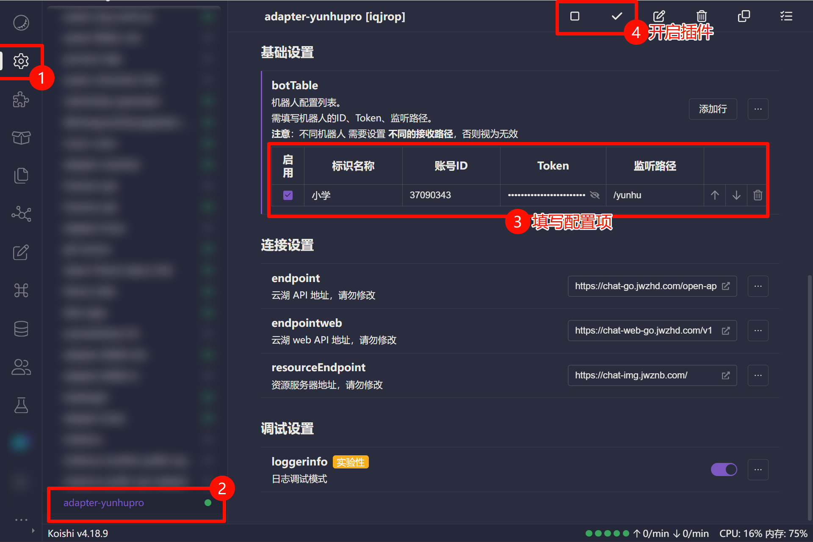

# 配置项说明

`adapter-yunhupro` 适配器的所有配置都在 Koishi 的插件配置页面中完成。

本页将详细介绍每个配置项的含义和用法。

## 基础设置

### 机器人配置列表 (`botTable`)

这是适配器的核心配置，它允许您同时管理一个或多个云湖机器人。

`botTable` 是一个列表，列表中的每一项都代表一个独立的机器人实例。您可以通过点击「添加行」来配置多个机器人。

对于列表中的每一项，您需要配置以下字段：

*   **`enable`**: (布尔值)
    *   **描述**: 控制该机器人实例是否启用。只有勾选此项，对应的机器人才会尝试连接和处理事件。
    *   **默认值**: `true`

*   **`botName`**: (字符串)
    *   **描述**: 为您的机器人设置一个易于识别的名称。此名称仅用于在 Koishi 界面中进行区分，不会影响机器人的实际功能。
    *   **必填**: 是

*   **`botId`**: (字符串)
    *   **描述**: 填写您在云湖平台创建的机器人的 **ID**。
    *   **必填**: 是

*   **`token`**: (字符串)
    *   **描述**: 填写您在云湖平台获取的机器人 **Token**。这是用于 API 认证的密钥，请妥善保管，不要泄露。
    *   **必填**: 是

*   **`path`**: (字符串)
    *   **描述**: 设置此机器人接收 Webhook 事件的路径。适配器会根据这个路径创建相应的监听服务。
    *   **默认值**: `/yunhu`
    *   **重要**: 如果您配置了多个机器人，**每个机器人的 `path` 必须是唯一的**。
    * > 例如，您可以为机器人 A 设置 `/yunhu/bot-a`，为机器人 B 设置 `/yunhu/bot-b`。重复的路径会导致只有一个机器人能正常工作。

## 连接设置

这些是与云湖 API 服务器连接相关的设置。通常情况下，您**不需要修改**这些默认值。

*   **`endpoint`**: (字符串)
    *   **描述**: 云湖开放平台 API 的主地址。
    *   **默认值**: `https://chat-go.jwzhd.com/open-apis/v1`

*   **`endpointweb`**: (字符串)
    *   **描述**: 云湖 Web API 的地址，用于一些特殊的内部接口调用。
    *   **默认值**: `https://chat-web-go.jwzhd.com/v1`

*   **`resourceEndpoint`**: (字符串)
    *   **描述**: 云湖的资源服务器地址，用于访问图片、文件等静态资源。
    *   **默认值**: `https://chat-img.jwznb.com/`

## 调试设置

*   **`loggerinfo`**: (布尔值)
    *   **描述**: 是否启用详细的日志调试模式。启用后，适配器会在 Koishi 的控制台中输出所有接收到的原始事件负载 (Payload) 和其他调试信息。这对于排查问题非常有用。
    *   **默认值**: `false`
    *   **建议**: 仅在需要进行问题排查时开启，以免产生过多的日志。
