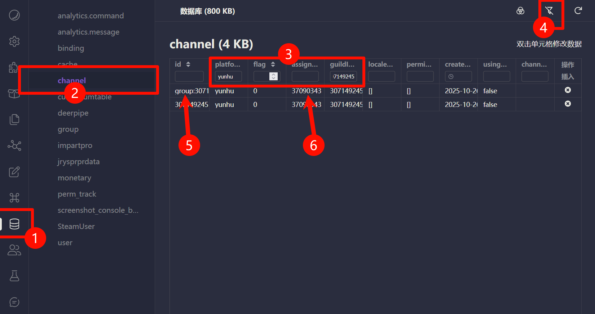
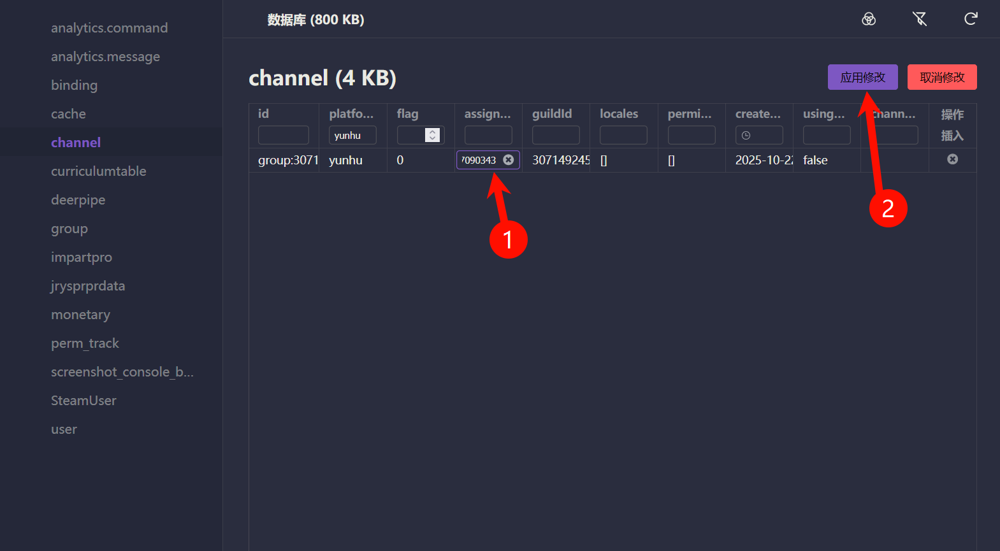

# 常见问题 (FAQ)

本页收集了用户在使用 `adapter-yunhupro` 时可能遇到的一些常见问题及其解决方案。

---

### Q1: 机器人配置正确，但收不到任何消息，也没有任何反应。

**检查 Webhook 配置**:
*   在云湖平台的机器人后台，仔细检查您填写的「订阅地址」是否正确。它应该是 `http(s)://你的公网地址:端口/path` 的完整形式。
*   确保「订阅地址」中的 `path` 与您在 Koishi 适配器配置中填写的 `path` 完全一致。

**检查事件订阅**:
*   在云湖后台，确认您已经勾选了需要接收的事件，特别是「消息事件」。

---

### Q2: 我配置了多个机器人，但只有一个能工作。

**A:** 这是因为多个机器人实例共享了同一个 Webhook `path`。

*   **解决方案**: 在 Koishi 的适配器配置中，为您的每一个机器人设置一个**唯一**的 `path`。
    *   例如：机器人 A 使用 `/yunhu/bot-a`，机器人 B 使用 `/yunhu/bot-b`。
    *   修改后，记得也要去云湖后台更新每个机器人对应的「订阅地址」。

---

### Q3: 机器人可以收到消息，但发送图片或文件失败。

*   **文件大小限制**: 您尝试发送的文件可能超过了云湖平台的大小限制。请尝试发送一个较小的文件。

---

### Q4: 如何切换频道代理人。

*   **Windows客户端限制**: 由于在云湖平台的Windows客户端不能直接at机器人，导致我们无法发送 `@机器人 assign` 来切换频道代理人。

*   **解决方案**: 在 Koishi 的 webUI 中，找到侧边栏的 `数据库` 按钮，点击进去修改`channel表`的对应的`assignee值`。

1. 找到侧边栏的 `数据库` 按钮。
2. 点击 `channel表`。
3. 输入过滤条件，在`platform`输入`yunhu`，在`guildId`输入你希望修改的频道ID。
4. 点击右上角的过滤按钮
5. 确认有`group:`的前缀
6. 双击修改对应的`assignee值`



7. 双击对应的 `assignee值` 位置，然后输入你想要响应的`机器人的ID`。
8. 点击右上角`应用修改`


---

### Q5: 如何在我的插件中调用云湖特有的 API？

**A:** 您可以通过 `bot` 对象实例来访问适配器封装的所有 API 方法。

*   **示例**: 在您的插件中，您可以通过 `session.bot` 来获取当前的 `Bot` 实例，然后调用其上的方法。

```typescript
import { Context } from 'koishi'

export function apply(ctx: Context) {
  ctx.command('test-yunhu-api').action(async ({ session }) => {
    if (session.platform !== 'yunhu') {
      return '此命令仅适用于云湖平台。'
    }

    try {
      // 调用获取用户信息的 API
      const userInfo = await session.bot.getUser(session.userId)
      console.log(userInfo)

      // 调用发送消息的 API
      await session.bot.sendMessage(session.channelId, '这是一条来自 API 调用的消息。')

      return 'API 调用成功！'
    } catch (error) {
      console.error('API 调用失败:', error)
      return 'API 调用失败，请检查日志。'
    }
  })
}
```

*   关于所有可用的 API 方法，请参考 [**开发文档 / APIs**](./../dev/apis.md) 章节。

### Q6 `h("html")`为什么发出的是图片？

解决方法见 [#html-消息](./../dev/additional/4.md#html-消息)